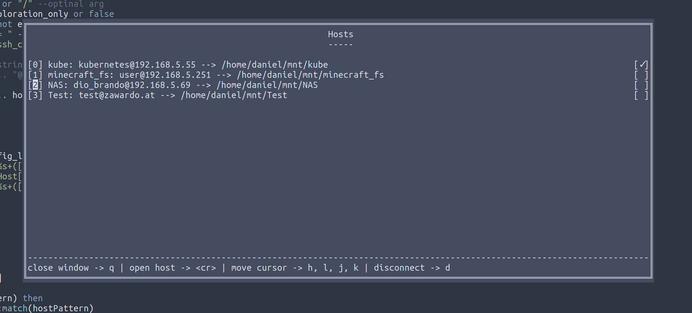

# nvim sshfs
A wrapper around sshfs for fast remote exploration and editing.




## Features
- [x] fast connections to a remote host from within nvim
- [x] ~/.ssh/config support
- [x] check the connection status of existing mounts
- [x] disconnect from mounts
- [x] (re-)Connect to existing mounts
- [x] NERDTree integration

## Usage
**Commands**
 * :SSHFSOpenHosts 
 * :SSHFSOpenQuickConnect 

### Keybindings for host window
 * q: close hosts window
 * d: disconnect from host under the cursor
 * \<enter>: connect with host under the cursor


## Setup
VimPlug:
```
Plug 'DanielWeidinger/nvim-sshfs'
```
In order for this PlugIn to work you have to enable the "user_allow_other" option in your ``/etc/fuse.conf`` file.
This allows for changes to be made to the files without starting sshfs as root
```
# /etc/fuse.conf - Configuration file for Filesystem in Userspace (FUSE)

# Set the maximum number of FUSE mounts allowed to non-root users.
# The default is 1000.
#mount_max = 1000

# Allow non-root users to specify the allow_other or allow_root mount options.
user_allow_other <-- Add this line
```
### Config
default config:
```
require("sshfs").setup {
	mnt_base_dir = vim.fn.expand("$HOME") .. "/mnt",
	width = 0.6, -- host window width
	height = 0.5, -- host window height
}
```

## Requirements
 * neovim >= 0.5
 * sshfs


TODO: warn about the dangers of the default configuration of this plugin: https://askubuntu.com/questions/123072/ssh-automatically-accept-keys
